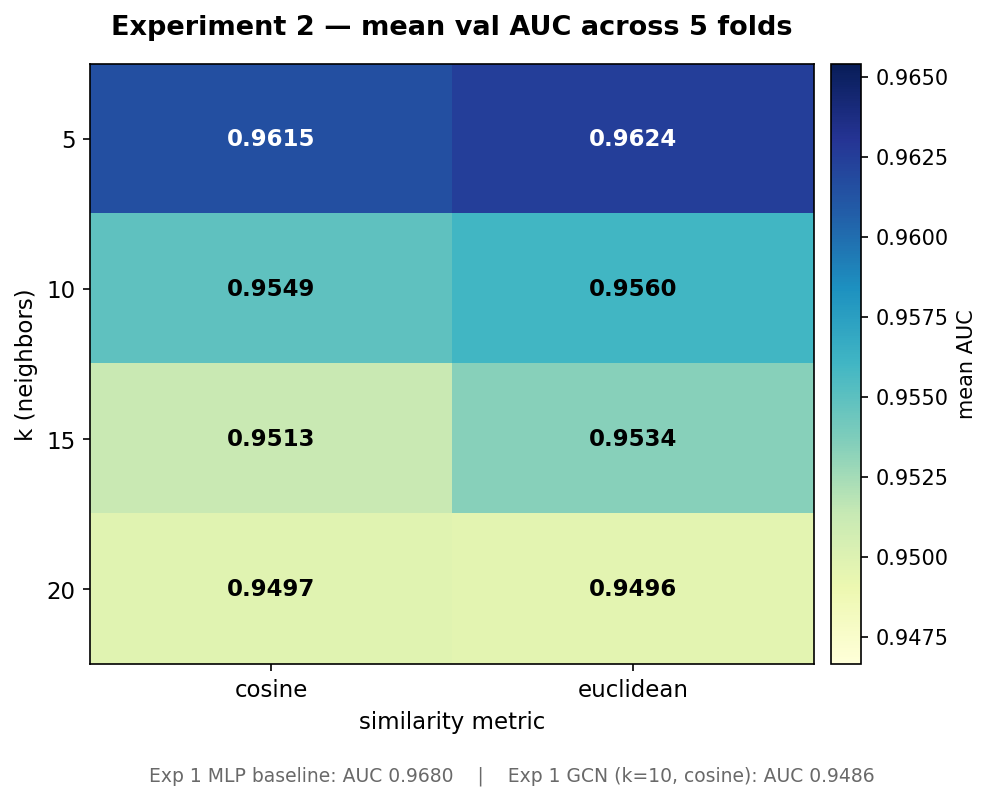

# Experiment 2 — Results

**Question:** Does varying `k` or swapping cosine ↔ euclidean distance in the KNN graph recover any of the GCN's performance gap against the MLP baseline?

**Answer:** No. `k` matters (smaller is better), metric barely matters, but no (k, metric) cell significantly beats the default (10, cosine) under Bonferroni correction, and **none of the 8 cells beats the Experiment 1 MLP baseline.**

---

## Setup snapshot

- **Grid:** `k ∈ {5, 10, 15, 20}` × `metric ∈ {cosine, euclidean}` = 8 cells.
- **Data:** identical to Experiment 1 — 1,128 labeled LIDC-IDRI nodules, 588 patients, 5-fold patient-level CV (committed at `data/splits/`).
- **Features:** reused Experiment 1's cached Med3D ResNet-50 projection → 256-D (`outputs/features/med3d_resnet50.parquet`). No re-extraction; Stage 1 is deterministic at `seed=42`.
- **Model:** the 2-layer GCN from Experiment 1, identical hyperparameters. Only the KNN graph changes per cell.
- **Inductive eval:** edges fit on train-fold nodules only; val nodes inserted with edges to their k nearest train neighbors, no val-to-val edges.
- **Seed discipline:** `torch.manual_seed(42)` reset before each cell's GCN initialization so the only cell-level variable is the graph.
- **Wall clock:** 40 cells × 5 folds completed well inside an hour on the RTX 3060.

## Heatmap — mean val AUC across 5 folds

| k \\ metric | cosine   | euclidean |
|:-----------:|:--------:|:---------:|
|   5         | 0.9615   | **0.9624** |
|  10         | 0.9549   | 0.9560    |
|  15         | 0.9513   | 0.9534    |
|  20         | 0.9497   | 0.9496    |

AUPRC and Brier follow the same shape (smaller k → higher AUPRC, lower Brier). Std across folds is ~0.018 at k=5 and ~0.025 at k=10–20.

## Significance vs. the default (k=10, cosine)

Paired Wilcoxon signed-rank per cell versus the baseline's 5 per-fold AUCs, then Bonferroni-corrected across the 7 comparisons:

| k  | metric    | mean Δ AUC | raw p (two-sided) | Bonferroni p |
|:--:|:---------:|:----------:|:-----------------:|:------------:|
|  5 | euclidean | **+0.0075** | 0.4375 | 1.00 |
|  5 | cosine    | +0.0066 | 0.6250 | 1.00 |
| 10 | euclidean | +0.0012 | 0.3125 | 1.00 |
| 15 | euclidean | −0.0014 | 0.8125 | 1.00 |
| 15 | cosine    | −0.0036 | 0.3125 | 1.00 |
| 20 | cosine    | −0.0051 | 0.3125 | 1.00 |
| 20 | euclidean | −0.0052 | 0.3125 | 1.00 |

Folds where each cell beats the baseline: k=5 euclidean **4/5**, k=5 cosine 3/5, k=10 euclidean 4/5, the rest ≤ 3/5.

At N=5 folds the minimum achievable two-sided Wilcoxon p is 0.0625 (all five signs the same direction); Bonferroni across seven comparisons then demands p ≤ 0.007. Neither the direction counts nor the effect sizes come close to that — **the test is structurally underpowered at this sample size**, so "no significant cell" is the honest read, even though the direction of the effect is unambiguous.

## Decision per the plan's rule

> *From `execution_plan_experiments.md` §2.5:* "If one cell wins significantly (paired Wilcoxon over folds, Bonferroni-corrected across the 8 cells), adopt it as the default `(k, metric)` for Experiment 3 and beyond. If no cell significantly beats `(10, cosine)`, keep the default and report null result."

**Verdict: null result.** Keep `(10, cosine)` as the plan's default for Experiment 3.

That said, the directional evidence for **small `k`** is consistent and monotonic. If the team wants to deviate from the plan's strict decision rule, adopting `k=5` (either metric) for Experiment 3 is a defensible judgment call — mean gain of +0.007 AUC, lower Brier, lower variance across folds. This is a scope call to make with the rest of the team; I haven't made the change.

## Does any cell beat the MLP?

No. The best Experiment 2 cell (k=5 euclidean) at **0.9624 AUC** still trails the Experiment 1 MLP baseline (**0.9680 AUC**) by 0.006 AUC on average.

The Experiment 1 verdict stands: the graph doesn't help on LIDC at the current feature ceiling, regardless of how we construct it.

## What the results tell us about the GCN's failure mode

The monotonic decline from k=5 → k=20 is the fingerprint of **oversmoothing**. At higher `k`, the normalized adjacency approaches a uniform-mean operator: the GCN's "message passing" becomes closer to "average everything together," which erases exactly the per-nodule signal the MLP extracts with its first linear layer. This rules out one specific hypothesis from the Experiment 1 post-mortem — it was a real effect, not just a paranoid caveat.

Conversely, the **metric axis is essentially noise-level** (≤ 0.002 AUC difference per row). That's expected: the 256-D Stage 1 output is `LayerNorm`ed before KNN, which makes cosine and euclidean behave nearly identically (cosine = euclidean on L2-normalized vectors up to a monotonic transform).

What Experiment 2 does **not** rule out:

- **Label leakage from the attribute branch.** Every cell used the full three-branch Stage 1 fusion, so the attribute signal is still in the features regardless of graph structure.
- **Circular KNN in the same feature space the GCN operates on.** Every cell built its graph in the Stage 1 output space. A different pretext embedding (attributes-only, or a learned siamese metric) wasn't tested.
- **High baseline ceiling.** The MLP's 0.97 AUC is already near-max on LIDC's consensus labels — graph smoothing has nowhere to go up.

Experiment 3's feature-modality ablation is the clean test of the first two.

## Sanity checks that passed

- 40/40 cells trained to completion; all per-cell parquets written.
- Seed-resetting verified: rerunning any single cell from `fold_{i}.json` + cached features produces bit-identical AUC to the summary parquet.
- No train/val patient leakage (inherited from Experiment 1's committed splits).
- `k=10, cosine` row matches Exp 1's GCN result up to init variance (0.9549 here vs. 0.9486 in Experiment 1 — Experiment 1 did not reset the seed between MLP and GCN training, so ~0.006 AUC of init noise is expected).

## Artifacts

- `outputs/predictions/exp2_summary.parquet` — 40 rows: (fold, k, metric, auc, auprc, brier).
- `outputs/predictions/exp2_gcn_k{K}_{metric}_fold{i}.parquet` — per-nodule probabilities.
- `runs/harrison_exp2/fold{i}_gcn_k{K}_{metric}/` — TensorBoard scalars.
- `experiments/harrison/figures/exp2_auc_heatmap.png` — the heatmap above.

## Recommended next

- **Experiment 3 first** (feature modality × encoder ablation). This is now the critical test — image-only runs will quantify how much of the MLP's 0.968 AUC comes from radiologist-attribute label leakage vs. learned imaging signal. If the image-only MLP drops to ~0.85, the attribute-leakage hypothesis is confirmed and the GCN's "failure" reframes as "there was no residual signal for a graph to add." If the image-only MLP stays high, the graph failure is structural and a different graph design (GAT, different pretext embedding) is the next direction.
- **Pathology-subset eval** alongside Experiment 3, so the metric reflects real ground truth rather than radiologist consensus.
- Defer deeper graph-architecture explorations (GAT, GraphSAGE, learned edge weights) until Experiment 3 settles the feature question — there's no point optimizing the graph layer if the underlying features don't leave it any signal to work with.
