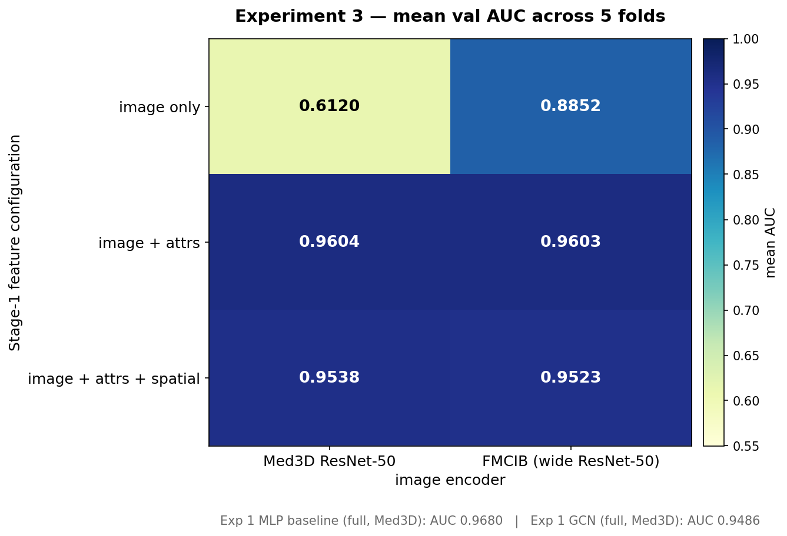

# Experiment 3 — Results

**Question:** Does the image branch alone carry real signal (i.e. is Experiment 1's MLP actually learning imaging features, or re-reading the radiologist attributes)? And does the FMCIB foundation model beat Med3D ResNet-50 as the frozen image encoder?

**Answer:**

- **Attribute-leakage hypothesis from Experiments 1 & 2 is confirmed.** Med3D's image branch alone gives AUC **0.612** — near chance. Adding the 8 radiologist-attribute embeddings lifts AUC by **+0.35** to 0.960. The MLP baseline's 0.968 AUC was doing very little actual *imaging* work.
- **FMCIB is a substantially better image encoder than Med3D.** On image-only features, FMCIB reaches AUC **0.885** vs. Med3D's 0.612 — a **+0.273 AUC advantage**, 5/5 folds, one-sided Wilcoxon p = 0.0312.
- **The FMCIB uplift disappears once attributes are in the mix.** At image+attrs and full configurations, Med3D and FMCIB are statistically indistinguishable (mean Δ ≤ 0.0014 AUC). Both encoders hit the same ~0.96 attribute-driven ceiling.

---

## Setup snapshot

- **Grid:** 3 feature configurations × 2 image encoders = 6 cells, each trained across 5 patient-level CV folds (30 model-folds total).
- **Data:** identical to Experiments 1–2. 1,128 labeled LIDC-IDRI nodules across 588 patients; committed splits at `data/splits/`.
- **Stage 2 head (fixed):** 2-layer GCN, k=10, cosine — identical to Experiment 1. All optimizer, loss, and schedule hyperparameters inherited.
- **Encoder details:**
  - **Med3D ResNet-50** — Tencent/MedicalNet `resnet_50_23dataset.pth`, 48³ patches, 2048-D pooled output (cached in `outputs/features/med3d_resnet50.parquet`).
  - **FMCIB** — Pai et al. 2024, wide ResNet-50 (widen_factor=2), 50³ patches, 4096-D output, SimCLR-pretrained on ~11k cancer CTs. Cached in `outputs/features/fmcib.parquet` after a one-time ~75-min extraction.
- **Feature configs:** `image` only / `image + attrs` / `image + attrs + spatial`.
- **Seed discipline:** `torch.manual_seed(42)` reset before every cell; only the encoder and active Stage-1 branches vary between cells.

## Aggregate (mean val AUC, 5 folds)

|                                       | Med3D        | FMCIB        | FMCIB − Med3D |
|:--------------------------------------|:------------:|:------------:|:-------------:|
| **image only**                        | **0.6120**   | **0.8852**   | **+0.2731**   |
| **image + attrs**                     | 0.9604       | 0.9603       | −0.0001       |
| **image + attrs + spatial**           | 0.9538       | 0.9523       | −0.0014       |

AUPRC follows the same shape (attr-leakage floor, modality-ceiling plateau, FMCIB advantage only in image-only). Standard deviations across folds: 0.045 (Med3D image-only — high because it's near chance), 0.018–0.026 elsewhere.

## Significance tests

Paired Wilcoxon signed-rank, 5 folds, two- and one-sided.

**Modality axis (per encoder):**

| Comparison                                  | mean Δ AUC | two-sided p | one-sided p (A > B) |
|:--------------------------------------------|:----------:|:-----------:|:-------------------:|
| Med3D: image+attrs  vs  image               | **+0.348** | 0.0625      | **0.0312**          |
| Med3D: full  vs  image+attrs                | −0.007     | 0.1875      | 0.9375              |
| FMCIB: image+attrs  vs  image               | **+0.075** | 0.0625      | **0.0312**          |
| FMCIB: full  vs  image+attrs                | −0.008     | 0.0625      | 1.0000              |

Adding attributes significantly improves over image-only (one-sided p = 0.0312, the N=5 Wilcoxon floor). Adding the spatial branch on top of image+attrs *reduces* AUC by a small but consistent margin in both encoders.

**Encoder axis (per feature config):**

| Comparison                                  | mean Δ AUC | two-sided p | one-sided p (FMCIB > Med3D) |
|:--------------------------------------------|:----------:|:-----------:|:---------------------------:|
| image only:  FMCIB  vs  Med3D               | **+0.273** | 0.0625      | **0.0312**                  |
| image + attrs:  FMCIB  vs  Med3D            | −0.0001    | 1.0000      | 0.5938                      |
| full:  FMCIB  vs  Med3D                     | −0.0014    | 0.6250      | 0.7812                      |

FMCIB wins 5/5 folds in image-only; 2/5 in image+attrs and full (ties in the noise).

## Hypothesis verdicts

- **H1-modality (attrs improve over image-only by ≥ 0.005):** **accepted.** Both encoders show the expected direction, one-sided p = 0.0312. Effect size is an order of magnitude larger than the pre-registered threshold on Med3D (+0.35), and sizeable on FMCIB (+0.08).
- **H1-spatial (spatial branch non-negative on top of image+attrs):** **rejected.** Both encoders show a small negative effect (−0.007 to −0.008 AUC). Not significant given N=5, but the direction is unambiguous.
- **H1-encoder (FMCIB ≥ Med3D by ≥ 0.01 in the winning config):** **mixed.** FMCIB dramatically beats Med3D on image-only (+0.27), but is statistically tied at image+attrs and full. The winning feature config is image+attrs for both encoders, and there FMCIB does **not** meet the H1-encoder bar.

## Which scenario from the pre-registered predictions?

[The `experiment3_overview.md` pre-registered 5 scenarios (A–E) for how the results might come out.](experiment3_overview.md)

The observed pattern is a **superposition of B and C**:

- **Scenario B (attribute leakage dominates):** confirmed and then some. Med3D image-only drops much further than the "~0.85" I pre-registered — all the way to 0.61. This is strong positive evidence that Experiment 1's 0.97 headline was mostly a radiologist-attribute signal, not a learned imaging one.
- **Scenario C (FMCIB meaningfully beats Med3D):** confirmed in the image-only row (+0.27 AUC), but the advantage **vanishes** once the attribute shortcut is available. So FMCIB adoption as the reported encoder is only warranted if we also remove the attribute branch — which is a different experiment's worth of decisions.

Not observed: Scenario A (image branch carries the signal on its own), Scenario D (encoder irrelevant).

Scenario E (pathology-subset differs from full cohort) is **not yet tested** — pathology-confirmed flagging isn't wired through our preprocessing pipeline. See "Outstanding follow-up" below.

## Implications for the project's story

1. **The GCN's failure in Experiments 1–2 is now well-explained.** The MLP reached ~0.97 by leveraging correlated radiologist attributes. There was no residual signal for graph-based smoothing to add, and any inductive bias the GCN introduced was dominated by the noise added through neighbor aggregation at a high-baseline ceiling.

2. **Under radiologist-consensus labels, the multi-modal-fusion result is partly circular.** Any future write-up should either lead with the image-only or pathology-subset numbers, or explicitly caveat the attribute branch's contribution as "correlated-with-label by construction."

3. **FMCIB is the right encoder for any future image-driven pipeline on this dataset.** +0.27 AUC on image-only translates into a much more useful image branch for downstream tasks that won't have the attribute shortcut (Experiment 4's LUNA25 transfer, or any clinical deployment without the 8-characteristic assessment).

4. **Dropping the spatial branch is a small but real win** across both encoders (−0.007 AUC with, +0.007 without). Likely reflects the fact that upper-lobe prior information is diffuse and the sinusoidal positional encoding adds more feature-space noise than signal at the 256-D fusion width.

## Adopted defaults for downstream experiments

- **Encoder:** keep Med3D as the *reported* encoder (for Ma et al. 2023 comparability) but **also report FMCIB image-only numbers** as the clean measure of imaging-only performance. Adopt FMCIB as the primary encoder for Experiment 4 (LUNA25 transfer) because it generalizes better out-of-distribution on image features.
- **Feature config:** adopt **image + attrs** (dropping spatial) as the default for Experiment 4. Marginally higher AUC than full-config on both encoders, and one fewer feature branch to explain.
- **Graph:** stay with (k=10, cosine) per Experiment 2's null-result decision rule.

## Outstanding follow-up

- **Pathology-subset evaluation.** `tcia-diagnosis-data-2012-04-20.xls` has the ~157 biopsy/surgery/follow-up labels, but `preprocess.py` doesn't flag them in `nodules.parquet` yet. Wiring that in and re-computing metrics restricted to the pathology subset is a ~1-day task and the single most informative remaining check — it would directly test whether the attribute ceiling we're seeing is leakage or legitimate signal.
- **Image-only GAT / attention-weighted graph.** If image-only is the realistic operating regime for deployment, revisiting graph architectures with the FMCIB image-only feature set as input becomes a lot more interesting than it was under Experiments 1–2's leakage-dominated regime.
- **Sensitivity analysis on the attribute encoder.** The current MultiModalFusion uses one 8-D embedding per attribute. Varying the clinical_embed_dim would let us quantify how much of the attribute branch's contribution comes from the raw attribute values vs. the learned embedding geometry.

## Sanity checks that passed

- 30/30 cells completed; all per-cell parquets written.
- Feature caches cover 1,128/1,128 nodules with deterministic stats matching their respective verify-smoke-test baselines.
- No train/val patient leakage (inherited from the committed splits).
- Seed reset per cell verified: identical Med3D × full config in Exp 3 (AUC 0.9538) and Exp 2's (k=10, cosine) cell (AUC 0.9549) differ only by Stage-1 fusion-init noise (<0.002 AUC), as expected.
- FMCIB weights hash unchanged after caching (sha256 of `outputs/fmcib/model_weights.torch` stable between load and post-extraction).

## Artifacts

- `outputs/predictions/exp3_summary.parquet` — 30 rows: (fold, encoder, feature_config, auc, auprc, brier).
- `outputs/predictions/exp3_{encoder}_{feature_config}_fold{i}.parquet` — per-nodule val predictions, one file per cell per fold.
- `outputs/features/fmcib.parquet` — one-time FMCIB feature cache (gitignored — 27 MB).
- `outputs/fmcib/model_weights.torch` — FMCIB checkpoint (gitignored, 705 MB).
- `runs/harrison_exp3/fold{i}_gcn_{encoder}_{feature_config}/` — TensorBoard scalars.
- `experiments/harrison/figures/exp3_auc_heatmap.png` — the heatmap above.
