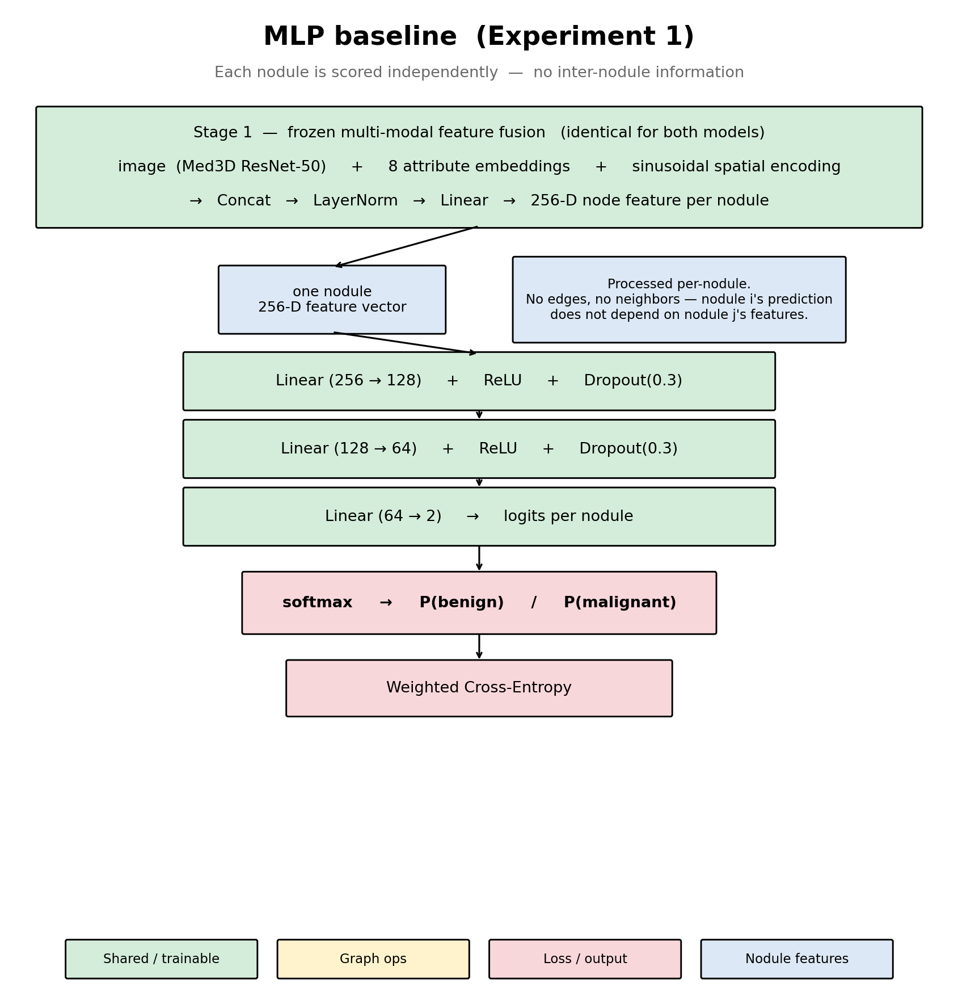
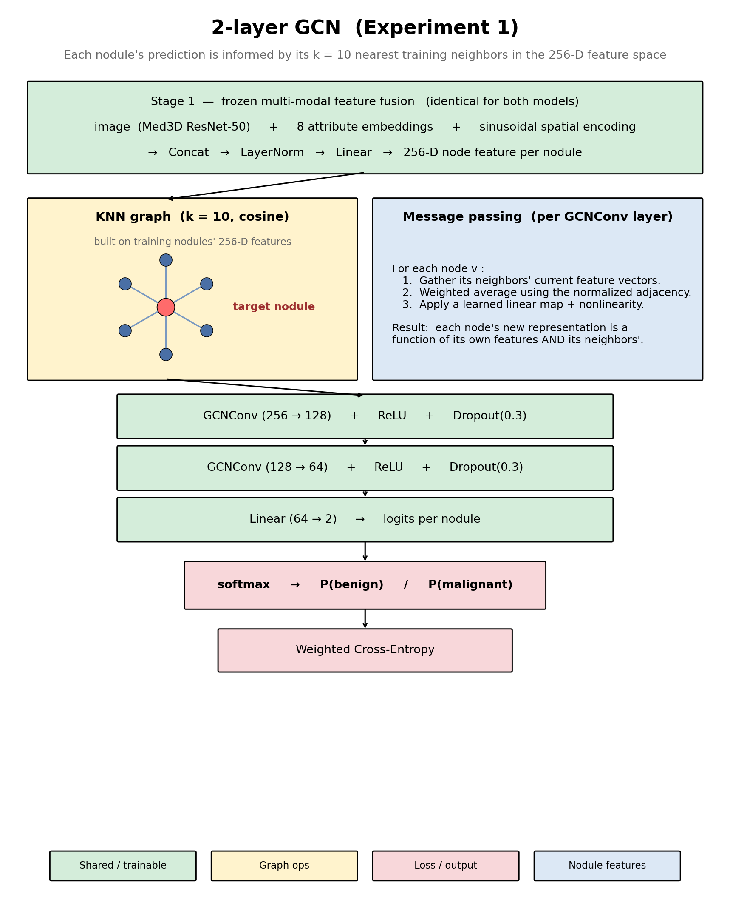

# GNN vs. GCN — and why our GCN underperformed the MLP

Companion to [`architecture_exp1.png`](architecture_exp1.png), with the head-specific diagrams [`figures/architecture_mlp.png`](figures/architecture_mlp.png) and [`figures/architecture_gcn.png`](figures/architecture_gcn.png).

---

## 1. GNN vs. GCN — what's the difference?

**GNN (Graph Neural Network)** is the *umbrella term* for any neural network that operates on graph-structured data — nodes connected by edges. It's a family, not a specific architecture.

**GCN (Graph Convolutional Network)** is one *specific* architecture inside that family, introduced by Kipf & Welling in 2017. At each layer it does:

$$
H^{(l+1)} = \sigma\!\left(\tilde{D}^{-1/2}\,\tilde{A}\,\tilde{D}^{-1/2}\,H^{(l)}\,W^{(l)}\right)
$$

In plain English: "take a normalized weighted average of each node's neighbors' features, then apply a learned linear map and a nonlinearity." That's the entire operator. Stack two or three of them and you have a 2- or 3-layer GCN.

Other common GNNs you may hear about are all siblings of GCN:

| Architecture | What makes it different |
|---|---|
| **GCN** (Kipf 2017) | Fixed normalized-average aggregation over neighbors. |
| **GraphSAGE** (Hamilton 2017) | Samples neighbors; aggregation can be mean, max, or LSTM. |
| **GAT** (Veličković 2018) | Learns attention weights over each edge — neighbors are no longer treated equally. |
| **GIN** (Xu 2019) | Sum aggregation; provably as expressive as the Weisfeiler-Leman graph test. |
| **MPNN** (Gilmer 2017) | General framework — every operator above is a special case. |

So: **every GCN is a GNN, but not every GNN is a GCN.** "GNN" ≈ "car." "GCN" ≈ "Honda Civic."

## 2. Is our architecture a GCN?

**Yes.** The plan and Experiment 1 use PyTorch Geometric's `GCNConv` layer, which is exactly the Kipf & Welling 2017 operator above. We stack two of them (so the receptive field is 2-hop), with ReLU, dropout, and a final linear head. See `models/gcn.py`:

```python
self.conv1 = GCNConv(in_dim, h1, add_self_loops=True, normalize=True)
self.conv2 = GCNConv(h1, h2,  add_self_loops=True, normalize=True)
# ...
h = self.conv1(x, edge_index); h = relu(dropout(h))
h = self.conv2(h, edge_index); h = relu(dropout(h))
logits = self.classifier(h)
```

The graph is a cohort-wide KNN nodule-similarity graph (k=10, cosine similarity) built in the same 256-D feature space the GCN operates on.

## 3. Explaining the approach in plain English

Imagine a room full of lung nodules, each described by a 256-D "profile" — a mix of what the CT image looks like (from a frozen Med3D ResNet-50), what eight expert radiologists said about it, and where in the chest it sits. Stage 1 produces this profile; both models consume it unchanged.

The two models differ in **how they turn the profile into a benign/malignant decision.**

### The MLP baseline — independent classification



Each nodule's 256-D profile is fed through a small feedforward network (three linear layers with ReLU + dropout in between). Every nodule is scored **in complete isolation** — the MLP has no idea that other nodules exist. It's the "obvious" approach: look at this patient's nodule, output a probability.

### The GCN — graph-based classification



Before scoring, we build a **similarity graph**. Each nodule is a node; we connect it by an edge to its 10 most-similar nodules (cosine similarity over the 256-D feature space). Then the GCN does **message passing** — at each layer, a nodule's new representation is a weighted combination of its own features AND its neighbors' features. After two layers, each nodule has "seen" information from its immediate neighbors and its neighbors-of-neighbors.

The hope: if an ambiguous nodule is surrounded by 10 confidently-malignant lookalikes, the GCN nudges its prediction toward malignant — a kind of principled "guilt by association" in feature space.

**This is a shared architecture between the MLP and GCN except for the head.** Same Stage 1 features, same hidden widths, same dropout, same optimizer, same loss, same schedule. The only difference is whether the features are combined with neighbors before the final linear head.

## 4. Why the GCN underperformed (Experiment 1)

Experiment 1 results: MLP 0.968 AUC vs. GCN 0.949, paired Wilcoxon MLP > GCN one-sided p = 0.031 on AUC, 5/5 folds favor the MLP. The graph hurt rather than helped. Five reasons that are all plausible, and that Experiment 2 and especially Experiment 3 are designed to disentangle.

### a. The baseline is already near the ceiling

The MLP reaches **0.968 AUC**. There is almost nothing left for a graph to add in signal — but there's plenty of room for it to add *noise*. When the features are already highly separable, the smartest move is to leave them alone.

### b. Label leakage via the attribute branch

The 8 "descriptive" attributes (subtlety, sphericity, margin, lobulation, spiculation, texture, internal structure, calcification) are scored 1–5 by **the same four radiologists** who also scored malignancy 1–5 in the same sitting. These attribute ratings are strongly correlated with the malignancy label by construction.

So the MLP is very likely doing something close to *re-reading the radiologist's own assessment*. That's a near-ceiling signal. The graph's message passing can't improve on "the radiologist says it's malignant" — but it can corrupt it by mixing in neighbor profiles. Experiment 3's image-only ablation is designed to check exactly this.

### c. Circular KNN over the same feature space the GCN operates on

The edges are built by taking cosine similarity in the same 256-D feature space the GCN then smooths over. That's partially redundant with the MLP's first linear layer, which already learns to project correlated inputs toward similar outputs. The GCN's smoothing step mostly repeats work the MLP does internally — while adding variance from whichever neighbors turned out to be wrong.

A cleaner setup would build the graph in a **different** space (e.g., attributes-only, or learned by a siamese pretext task) so the graph provides signal the GCN can't recover from the raw features. This is a future-work direction, not part of the current plan.

### d. Noisy edges at a high baseline

With k = 10, each val nodule depends on 10 training neighbors. If even 2 or 3 of those 10 have a different true label from the val nodule, their features still averaged into its representation. At the MLP's already-high accuracy, *mis-specified neighbors hurt more than correct neighbors help*. With only ~220 val nodules per fold, those errors aren't drowned out by volume.

### e. Oversmoothing is possible but unlikely at 2 layers

GCNs are known to collapse node representations toward the graph mean as you stack more layers ("oversmoothing"). At 2 layers this usually isn't the dominant failure mode — but Experiment 2's `k ∈ {5, 10, 15, 20}` sweep will surface it if it *is* a factor here (high k makes the normalized adjacency closer to a uniform mean, which is oversmoothing by another name).

### What would change the picture

- **Exp 3 image-only run** — if the MLP drops from 0.97 to ~0.85 when attributes are removed, (b) is confirmed as the dominant effect and the GCN's "failure" is really a "near-ceiling draw."
- **Graph construction change** — building the KNN in a non-overlapping space, or using GAT to learn edge weights, would test (c).
- **Pathology-subset eval** — evaluating on the ~157 pathology-confirmed nodules gives a cleaner ground-truth signal; the attribute-leakage ceiling only exists against radiologist-consensus labels.

## 5. Short TL;DR for a confused reader

> A GNN is any neural net for graph-structured data. A GCN is one specific, classic GNN architecture (Kipf & Welling 2017). Our architecture uses two GCN layers stacked with ReLU/dropout — it is a GCN. The MLP baseline is the same architecture minus the graph step. On LIDC-IDRI the MLP wins because the features (which include radiologist attributes correlated with the label by construction) are already near-ceiling discriminative, and the GCN's neighbor-averaging step has more capacity to add noise than signal in that regime. Experiment 3 will separate "the graph doesn't help" from "there was never anything for it to add in the first place."
