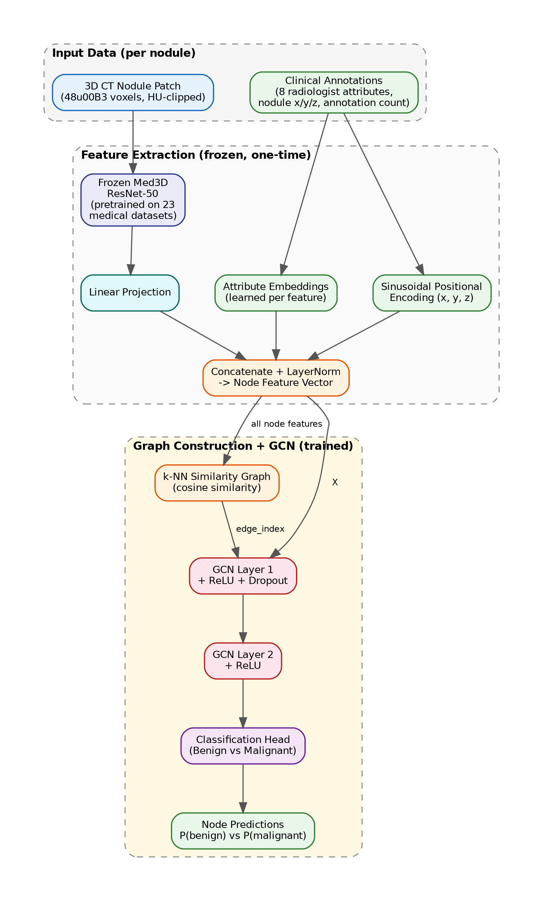

# GNN for CT Mapping — Lung Nodule Malignancy Classification

Graph Neural Network-based malignancy classification of lung nodules in CT scans, developed for CSC 7760 Deep Learning.

**Authors:** Rensildi Kalanxhi, Harrison Lavins, Swathi Gopal

---

## Goal

Current deep learning models classify lung nodules independently, ignoring relationships between similar cases. This project builds a GNN that constructs a patient-level graph over nodules and performs malignancy classification by aggregating information across neighbors. A secondary goal is uncertainty quantification using Mahalanobis distance in the learned embedding space to flag out-of-distribution cases.

## Architecture



Two-stage pipeline:

**Stage 1 — Multi-modal feature extraction (frozen at inference)**

Each nodule is represented by three fused components:
- **Image:** 48³-voxel CT patch → frozen Med3D ResNet-50 → linear projection
- **Clinical:** 8 LIDC-IDRI radiologist attributes (subtlety, sphericity, margin, etc.) → learned embeddings
- **Spatial:** (x, y, z) coordinates → sinusoidal positional encoding

**Stage 2 — Graph construction and classification (trained)**

- KNN graph over nodule feature vectors (cosine similarity, default k=10)
- 2-layer custom GCN with dropout
- Binary classification head (benign / malignant)
- Weighted cross-entropy loss for class imbalance
- Mahalanobis distance in embedding space for OOD detection

## Datasets

| Dataset | Scans | Nodules | Labels |
|---------|-------|---------|--------|
| LIDC-IDRI (primary) | 1,018 | 7,371 | Up to 4 radiologist scores per nodule; binarized at ≤2 / ≥4 |
| LUNA25 (cross-dataset eval) | 4,096 | 6,163 | Binary from clinical follow-up |

Full CT volumes are not stored in this repository. See [`GNN_for_CT_Mapping/data/README.md`](GNN_for_CT_Mapping/data/README.md) for download instructions.

## Repository Structure

```
.
├── requirements.txt
├── GNN_for_CT_Mapping/
│   ├── src/                # Shared, reviewed Python package
│   │   ├── data/           # Dataset classes, pylidc loaders, preprocessing
│   │   ├── models/         # Promoted model architectures
│   │   ├── training/       # Training loops, loss functions, metrics
│   │   └── utils/          # Shared helpers
│   ├── scripts/            # Shared entry-point scripts (train, evaluate, preprocess)
│   ├── notebooks/          # Shared Jupyter notebooks for EDA and analysis
│   ├── configs/
│   │   ├── default.yaml    # Shared hyperparameters (edit via PR)
│   │   └── paths.yaml      # Dataset path template (copy → paths.local.yaml)
│   ├── data/
│   │   ├── annotations/    # LIDC-IDRI nodule metadata and attribute CSVs
│   │   └── splits/         # Patient-level CV fold definitions
│   ├── experiments/
│   │   ├── harrison/       # Personal notebooks, model variants, config overrides
│   │   ├── swathi/         # (each: notebooks/, models/, scripts/, configs/, figures/)
│   │   └── rensildi/
│   ├── outputs/            # gitignored — checkpoints and predictions
│   ├── runs/               # gitignored — TensorBoard event files
│   └── figures/            # Shared plots and diagrams (committed)
└── proposal/               # Project proposal (Markdown + LaTeX source + PDF + architecture diagram)
```

## Setup

Run these commands once after cloning:

```bash
# Activate the virtual environment
source AI/bin/activate

# Install dependencies
pip install -r requirements.txt

# Install the notebook output filter (prevents spurious notebook conflicts)
nbstripout --install

# Set up your local dataset paths
cp GNN_for_CT_Mapping/configs/paths.yaml GNN_for_CT_Mapping/configs/paths.local.yaml
# Edit paths.local.yaml with the paths to your local CT volume directories
```

## Workflow

### Day-to-day experimentation

All personal work — notebooks, model variants, training scripts, and result figures — lives under `GNN_for_CT_Mapping/experiments/<your-name>/`. This keeps each person's work isolated and avoids merge conflicts on shared files.

Each person has a `configs/experiment.yaml` that is merged on top of the shared `default.yaml` at load time. Only specify the keys you are changing:

```yaml
# experiments/harrison/configs/experiment.yaml
model:
  gcn_layers: 3
graph:
  k_neighbors: 15
```

Model checkpoints and predictions write to `outputs/` using a named subdirectory so runs don't overwrite each other (e.g. `outputs/checkpoints/harrison_3layer_gcn/`). That directory is gitignored.

### Promoting work to shared code

When a model variant, preprocessing step, or utility is ready for the whole team to build on, open a pull request to move it from `experiments/<your-name>/` into `src/`. Changes to `src/` and `configs/default.yaml` always go through a PR so the team can review before they affect everyone.

### Avoiding merge conflicts

- **Notebooks:** `nbstripout` is configured as a git filter (`.gitattributes`) and strips cell outputs and execution counts automatically on commit. This eliminates the most common source of notebook conflicts.
- **Configs:** Use your personal `experiment.yaml` for overrides rather than editing `default.yaml` directly.
- **Models:** Write variants in `experiments/<your-name>/models/` first; promote to `src/models/` via PR.
- **Binary files:** `.gitattributes` marks images, PDFs, checkpoints, and serialized data as binary so git never attempts to merge them.

### TensorBoard

```bash
tensorboard --logdir GNN_for_CT_Mapping/runs
```

### Proposal PDF

```bash
cd proposal/Proposal_LaTeX
pdflatex Proposal.tex
```

For LaTeX environment setup (Windows and Ubuntu), see [`proposal/Proposal_LaTeX/LATEX_SETUP.md`](proposal/Proposal_LaTeX/LATEX_SETUP.md).
